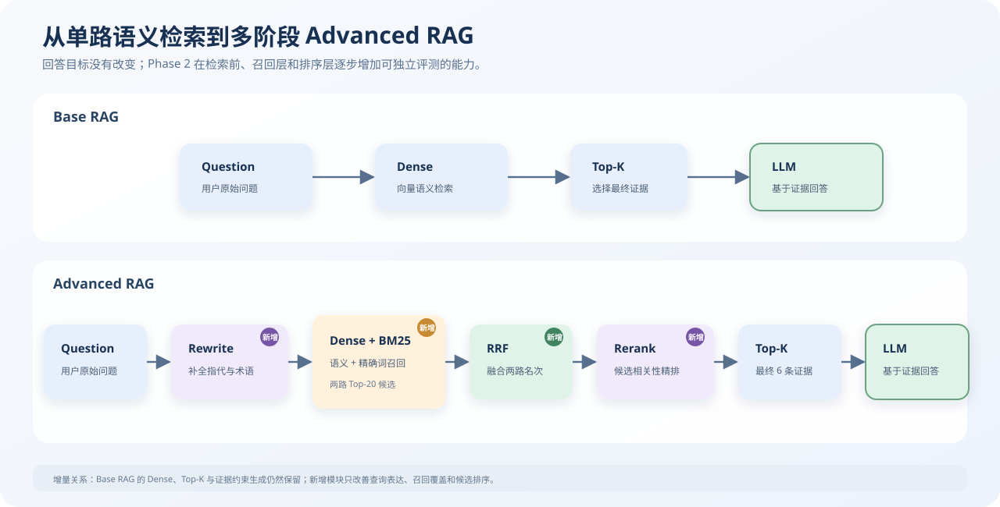
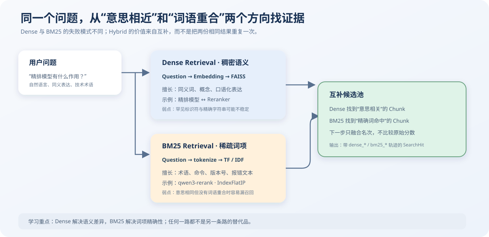
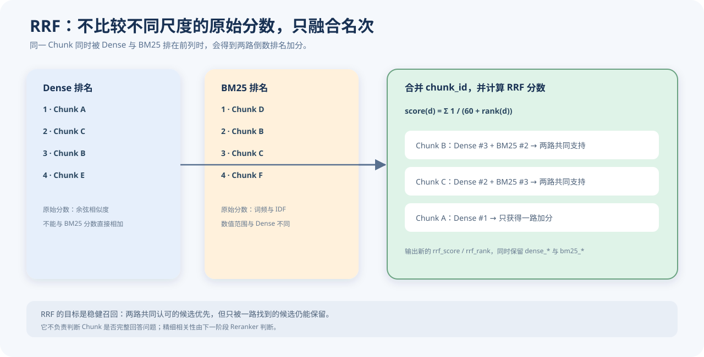
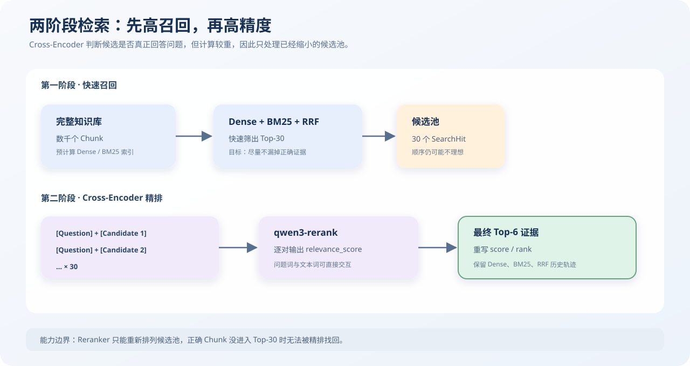
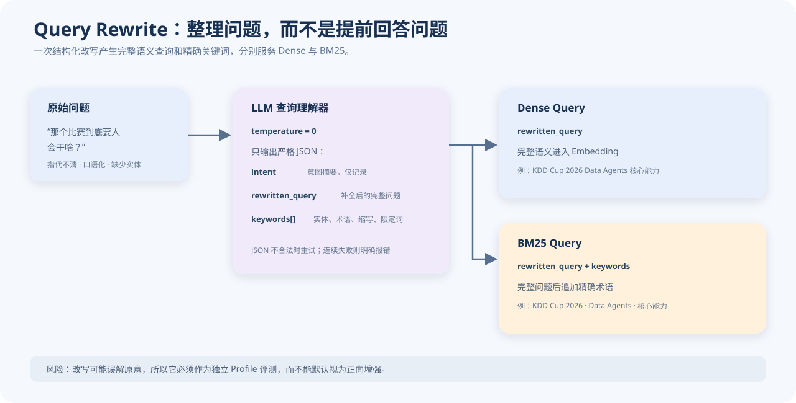
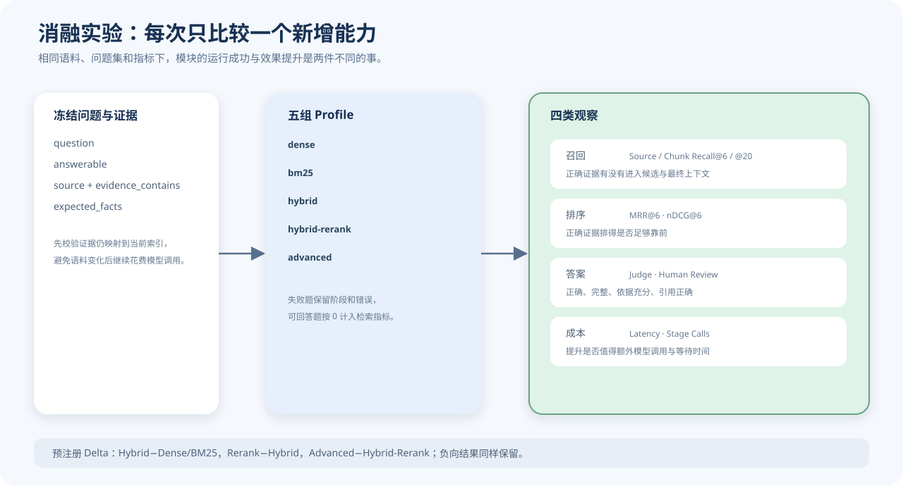
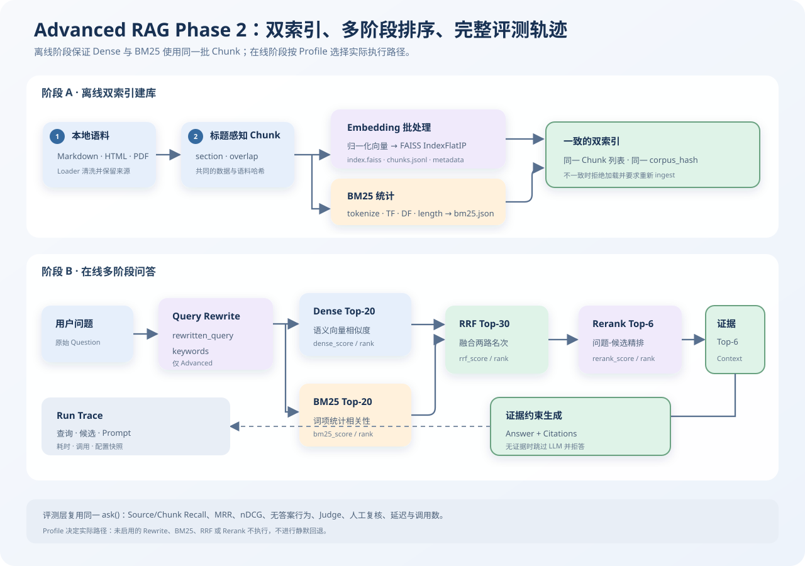

# Advanced RAG：混合检索、重排与查询改写设计

> 文档性质：Phase 2 新增模块的学习说明与系统架构
> 代码核对日期：2026-08-24
> 当前实现：Dense / BM25 / Hybrid / Hybrid-Rerank / Advanced 五组可比较 Profile

Base RAG 已经建立了最小闭环：文档经过切块和 Embedding 进入 FAISS，问题通过 Dense Retrieval 找到 Top-K Chunk，最后由大语言模型基于证据回答。

Phase 2 不改变这条链路的目标，而是针对三个常见问题逐层增强：

1. **只靠语义检索可能漏掉精确术语**：增加 BM25 稀疏检索；
2. **召回结果不等于最佳排序**：先用 RRF 融合两路召回，再用 Reranker 精排；
3. **用户问题不一定适合直接检索**：在检索前增加一次结构化 Query Rewrite；
4. **模块执行成功不代表模块有效**：增加证据级指标与五组 Profile 消融实验。

Phase 2 的核心变化可以概括为：



本文先分别说明每个新增模块解决什么问题、依据什么原理工作，再给出完整的 Advanced RAG 架构。

## 1. Phase 2 新增模块

### 1.1 `models.py`：让一个命中记录完整保留多阶段排名

Base RAG 中的 `SearchHit` 只需要表达一个 Chunk 的最终相似度和排名。Phase 2 引入 Dense、BM25、RRF 和 Rerank 后，同一个 Chunk 会连续经过多个排序阶段。如果只保存最终 `score`，就无法解释它为什么上升或下降。

当前 `SearchHit` 因此增加了四组过程字段：

```Python
SearchHit(
    chunk=chunk,
    score=0.91,
    rank=1,
    dense_score=0.72,
    dense_rank=8,
    bm25_score=6.34,
    bm25_rank=2,
    rrf_score=0.0318,
    rrf_rank=3,
    rerank_score=0.91,
    rerank_rank=1,
)
```

其中，`score` 和 `rank` 表示当前阶段的有效结果；`dense_*`、`bm25_*`、`rrf_*`、`rerank_*` 保存每一阶段留下的轨迹。

```text
Dense 第 8 名 → BM25 第 2 名 → RRF 第 3 名 → Rerank 第 1 名
```

这组字段把“检索结果”升级成了“可解释的检索过程”。当最终答案错误时，可以继续判断：正确 Chunk 是从未召回，还是进入候选后被错误排序。

### 1.2 `bm25.py`：增加擅长精确词匹配的稀疏检索

Dense Retrieval 会把问题和 Chunk 分别编码成稠密向量，再按向量相似度检索。它擅长同义表达和概念匹配，但面对版本号、命令、代码标识符和罕见缩写时，不一定稳定。

BM25 从另一个角度判断相关性：

* 问题中的词是否出现在 Chunk 中、出现多少次
* 这个词在整个语料中是否稀有
* 当前 Chunk 是否过长。



BM25 被称为稀疏检索，是因为文本可以表示为一个词表向量：语料词表很大，而一个 Chunk 只包含少数词，大部分维度都是零。

当前实现先将文本分词：

- 中文部分使用 `jieba`；
- 英文、数字和技术标识符保留为整体；
- 所有英文统一转成小写；
- 标题、章节和正文共同参与统计。

例如：

```text
qwen3-rerank 可以对 RRF 候选做二阶段精排
```

会保留 `qwen3-rerank`、`rrf` 等技术词，同时对中文部分分词。

对查询中的每个词，BM25 分数可理解为：

```math
score(q,d)=\sum_{t\in q} IDF(t)\cdot
\frac{TF(t,d)(k_1+1)}
{TF(t,d)+k_1(1-b+b\cdot |d|/avgdl)}
```

公式中的三个核心因素是：

| 因素        | 含义                          | 作用                               |
| ----------- | ----------------------------- | ---------------------------------- |
| `TF(t,d)` | 词在当前 Chunk 中出现的次数   | 出现越多通常越相关，但收益逐渐饱和 |
| `IDF(t)`  | 词在整个语料中的稀有程度      | 越少见的词越有区分力               |
| 长度归一化  | 当前 Chunk 长度与平均长度之比 | 避免长文本仅因包含更多词而占优势   |

当前参数为 `k1=1.5`、`b=0.75`。建库时，词频、文档频率、Chunk 长度和分词器版本会保存到 `bm25.json`。

BM25 与 Dense 不是替代关系，而是互补关系：

| 问题类型                     | Dense                                  | BM25                       |
| ---------------------------- | -------------------------------------- | -------------------------- |
| “精排模型有什么作用？”     | 能理解“精排”与“Reranker”的语义接近 | 文档未出现相同词时可能漏掉 |
| “`IndexFlatIP` 是什么？” | 罕见标识符的语义表示可能不稳定         | 精确命中标识符时优势明显   |
| 口语化、同义改写             | 通常更强                               | 依赖实际分词重合           |
| 命令、版本号、报错文本       | 可能召回相似概念                       | 通常更适合精确匹配         |

### 1.3 `retrieval.py`：使用 RRF 融合 Dense 与 BM25 排名

Dense 分数与 BM25 分数来自不同计算空间：Dense 是归一化向量的内积，BM25 是词频、稀有度和长度共同形成的统计分。两者的数值范围与含义不同，不能直接相加。

RRF（Reciprocal Rank Fusion，倒数排名融合）绕开原始分数，只使用每个 Chunk 在各检索器中的名次：

```math
RRF(d)=\sum_{r\in rankings}\frac{1}{k+rank_r(d)}
```

当前 `k=60`。某个 Chunk 没有出现在一路结果中，就不获得该路加分；同时出现在 Dense 与 BM25 前列的 Chunk 会获得两路加分。



例如：

```text
Chunk A：Dense 第 1，BM25 未命中
RRF(A) = 1 / (60 + 1)

Chunk B：Dense 第 3，BM25 第 2
RRF(B) = 1 / (60 + 3) + 1 / (60 + 2)
```

即使 Chunk B 在任何一路都不是第一名，它也可能因为获得两路共同支持而排到融合结果前面。

代码先用 `chunk_id` 合并重复命中，再保留 `dense_*` 和 `bm25_*` 字段，最后写入新的 `rrf_score` 与 `rrf_rank`。同分时按 `chunk_id` 排序，使重复运行保持确定性。

RRF 的职责是提高候选池的稳健性。它不会判断一个 Chunk 是否真正回答了问题，这一步交给后续 Reranker。

### 1.4 `rerank.py`：使用二阶段精排提升正确证据的位置

Dense、BM25 和 RRF 的目标是高召回：尽量把可能相关的 Chunk 放进候选池。候选池中的文本可能只是出现了相同术语，或主题相近，却没有直接回答问题。

Rerank 的目标是高精度：把用户问题与每个候选 Chunk 放在一起进行更细粒度的相关性判断，然后只返回最相关的少量证据。



典型的 Reranker 使用 Cross-Encoder 思路：

```text
[Question] + [Candidate Chunk]
              ↓
        同一个 Transformer
              ↓
        relevance_score
```

它与 Dense Retrieval 常用的 Bi-Encoder 有明显区别：

| 结构          | 编码方式                                | 优点                               | 代价                                   |
| ------------- | --------------------------------------- | ---------------------------------- | -------------------------------------- |
| Bi-Encoder    | 问题与 Chunk 分开编码，再计算向量相似度 | Chunk 向量可提前保存，适合全库检索 | 问题与文本缺少逐 Token 交互            |
| Cross-Encoder | 问题与 Chunk 一起输入模型               | 能细致判断文本是否真正回答问题     | 每次提问都要重新计算每个候选，速度较慢 |

因此，Reranker 只处理 RRF 已经筛出的有限候选，而不扫描整个知识库。

当前代码将原始用户问题、候选 Chunk 正文、`top_n` 和任务说明发送给 `qwen3-rerank` 服务。服务返回候选索引和 `relevance_score`，程序校验越界、重复和无效分数后，写入新的 `rerank_score` 与 `rerank_rank`。

Rerank 的能力边界也很明确：

> 如果正确证据没有进入候选池，Reranker 无法凭空找回它；它只能重新排列已有候选。

### 1.5 `rewrite.py`：把自然语言问题整理成可检索查询

用户问题不一定是适合检索的表达。例如“那个比赛要人会干啥”包含指代和口语，Dense 可能理解得不稳定，BM25 也缺少可以精确匹配的实体与术语。

Query Rewrite 在检索前调用一次大语言模型，将问题整理成结构化结果：

```JSON
{
  "intent": "了解 KDD Cup 2026 Data Agents 的核心能力要求",
  "rewritten_query": "KDD Cup 2026 Data Agents 比赛强调哪些核心能力？",
  "keywords": ["KDD Cup 2026", "Data Agents", "核心能力"]
}
```



当前 Prompt 要求模型：

```text
你是 RAG 查询理解器。分析用户问题并只输出一个 JSON 对象，不要 Markdown、解释或代码块。
JSON 必须严格含有 intent（字符串）、rewritten_query（字符串）和 keywords（字符串数组）。
rewritten_query 应补全指代与上下文，保持原意；keywords 只保留实体、术语、缩写、版本号和限定词。
```

三个字段的用途不同：

- `intent`：保存模型对用户意图的概括，当前仅用于运行记录；
- `rewritten_query`：作为 Dense 的查询文本；
- `rewritten_query + keywords`：共同作为 BM25 查询，补充精确术语。

改写使用 `temperature=0`，并严格检查 JSON 结构。

### 1.6 `pipeline.py`：用 Profile 编排不同能力组合

`pipeline.py` 将新增模块组合成五个可比较的 Profile：

| Profile           | Dense | BM25 | RRF | Rerank | Rewrite |
| ----------------- | ----: | ---: | --: | -----: | ------: |
| `dense`         |    ✓ |      |     |        |         |
| `bm25`          |       |   ✓ |     |        |         |
| `hybrid`        |    ✓ |   ✓ |  ✓ |        |         |
| `hybrid-rerank` |    ✓ |   ✓ |  ✓ |     ✓ |         |
| `advanced`      |    ✓ |   ✓ |  ✓ |     ✓ |      ✓ |

* 离线 `ingest()` 在原有 FAISS 索引之外，同步建立 BM25 索引。
* 在线 `ask()` 按 Profile 依次执行 Rewrite、索引加载、Dense/BM25 召回、RRF、Rerank、Context 装配与生成。

默认候选规模为：

```text
Dense Top-20 ─┐
              ├→ RRF Top-30 → Rerank Top-6 → LLM Context
BM25 Top-20 ──┘
```

最终运行记录会保存 Rewrite 结果、两路查询、每层候选及排名、Prompt、答案、引用、模型身份、阶段耗时和调用次数。

### 1.7 `evaluation.py`：用证据级指标判断模块是否有效

Phase 2 将 Base RAG 的来源命中评估扩展为“召回、排序、答案质量和成本”四类观察。



主要自动检索指标包括：

| 指标                       | 评测问题                              |
| -------------------------- | ------------------------------------- |
| Source Recall@6            | 最终 Top-6 是否至少来自正确文章       |
| Chunk Recall@6             | 最终 Top-6 是否包含标注的正确证据片段 |
| Chunk Recall@20            | 正确证据是否进入较大的初始候选池      |
| MRR@6                      | 第一个正确 Chunk 排得有多靠前         |
| nDCG@6                     | Top-6 中相关 Chunk 的整体排序质量     |
| unanswerable_retrieved     | 无答案题是否仍返回了检索结果          |
| mean latency / stage calls | 指标变化付出了多少延迟和模型调用      |

其中，`Chunk Recall@20` 与 `Chunk Recall@6` 的组合可以区分两类问题：

```text
Recall@20 = 0
→ 正确证据没有进入候选池，属于召回问题

Recall@20 = 1，Recall@6 = 0
→ 正确证据已被召回但排序靠后，属于排序问题
```

实验固定比较：

```text
Hybrid - Dense             → BM25 + RRF 的增量价值
Hybrid - BM25              → Dense + RRF 的增量价值
Hybrid-Rerank - Hybrid     → Reranker 的增量价值
Advanced - Hybrid-Rerank   → Query Rewrite 的增量价值
```

评测还可以使用 LLM Judge 对 `correctness`、`completeness`、`groundedness` 和 `citation_correctness` 给出 0～2 分，并生成匿名的 Dense/Advanced 人工复核表。不过当前主报告仍以检索指标和延迟为主，Judge 与人工复核是辅助证据，不应与确定性的检索指标混为一个总分。

## 2. Advanced RAG 架构

### 2.1 完整架构图


