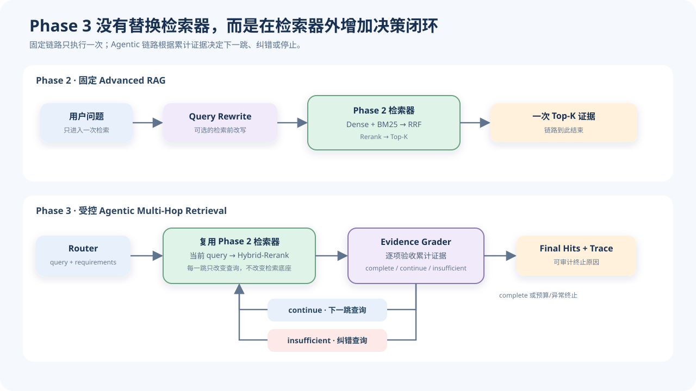
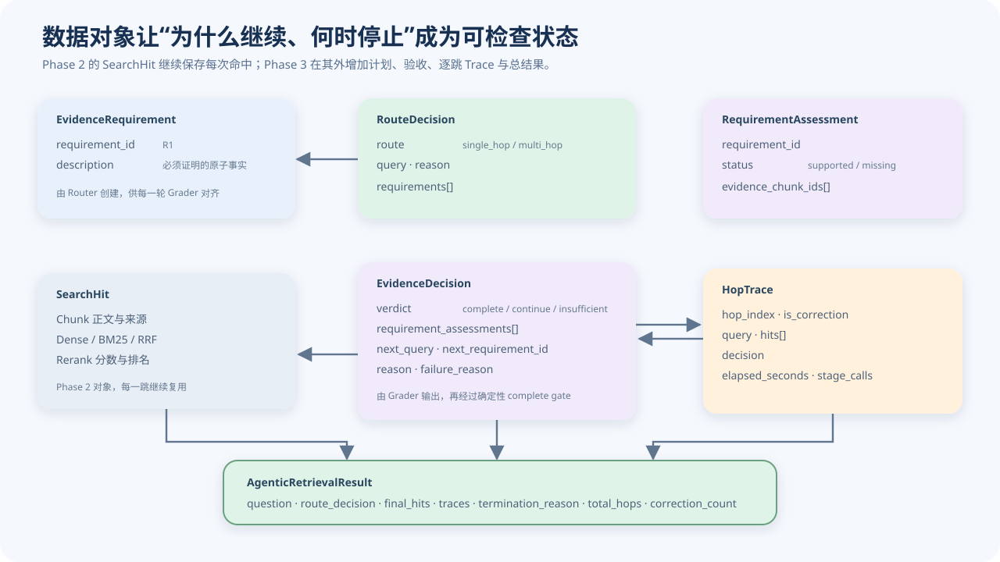
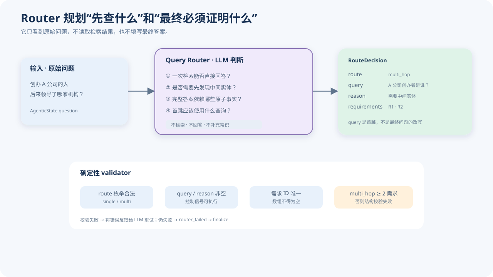
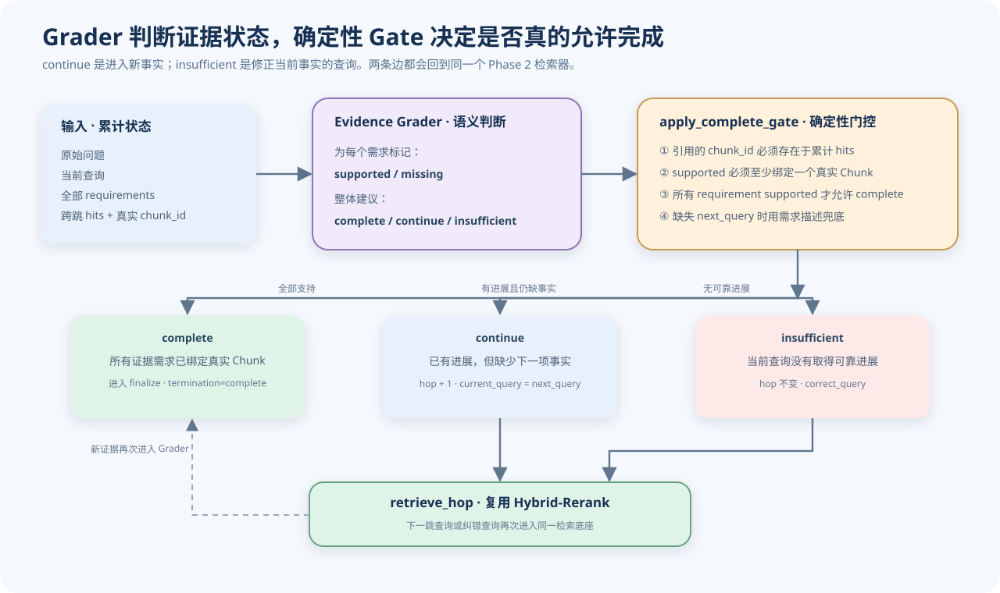
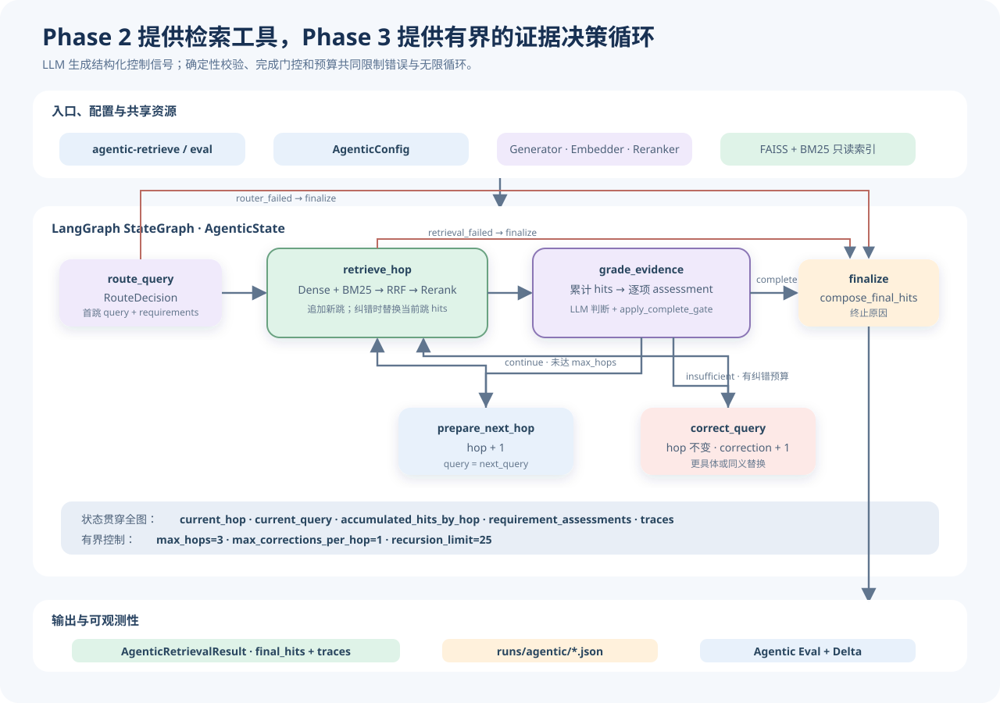

# Agentic RAG：受控多跳检索与证据闭环设计

> 文档性质：Phase 3 新增模块的学习说明与系统架构
> 代码核对日期：2026-08-25
> 当前实现：基于 LangGraph 的受控 Agentic Multi-Hop Retrieval
> 能力边界：当前 Phase 3 输出多跳证据、路由决策与完整 Trace，不负责生成最终自然语言答案

Phase 2 已经完成一条固定的 Advanced RAG 链路：问题经过 Dense 与 BM25 双路召回、RRF 融合和 Reranker 精排，得到一次检索的 Top-K 证据。它解决了“怎样把相关证据找得更全、排得更准”，但整条链路仍然只执行一次。

当问题需要先发现中间实体，再围绕中间实体继续查找时，一次检索可能只找回证据链的一部分。例如：

> 创办 A 公司的人后来领导了哪家机构？

完整回答至少需要两项事实：

1. A 公司的创办者是谁；
2. 这位创办者后来领导了哪家机构。

如果第一轮只检索到“A 公司由张三创办”，固定链路不会主动把“张三”变成下一轮查询。Phase 3 因此在 Phase 2 检索器外增加一个有状态、受预算约束的控制闭环：先规划必须找到的证据，再逐跳检索、逐项验收，证据缺失时决定进入下一跳或纠正当前查询。



本文先分别说明 Phase 3 新增模块解决什么问题、依据什么原理工作，再给出完整的 Agentic RAG 架构。

## 1. Phase 3 新增模块

### 1.1 `models.py`：把检索结果扩展成可执行、可审计的 Agent 状态

Phase 2 的核心对象是 `SearchHit`。它回答“某个 Chunk 在 Dense、BM25、RRF 和 Rerank 中排第几”。Phase 3 还需要表达四类新信息：问题被怎样规划、哪些事实必须有证据、每一跳做了什么，以及整个任务为什么结束。



`EvidenceRequirement`：必须由检索证据直接支持的原子事实

```Python
EvidenceRequirement(
    requirement_id="R1",
    description="证明 A 公司的创办者是谁。",
)
```

Router 不直接填写答案，而是把完整回答拆成一组可独立核验的需求。`requirement_id` 是后续 Grader 对齐需求和证据的稳定标识，`description` 说明必须查明的事实。

`RouteDecision`：一次路由规划

```Python
RouteDecision(
    route="multi_hop",
    query="A 公司的创办者是谁？",
    reason="需要先发现创办者，再查询其后续任职。",
    requirements=[R1, R2],
)
```

其中，`route` 只能是 `single_hop` 或 `multi_hop`；`query` 是马上执行的首跳检索词，不一定等于原始问题；`requirements` 是最终完成任务前必须全部被真实 Chunk 支持的证据清单。

`RequirementAssessment`：一项需求当前是否有证据

```Python
RequirementAssessment(
    requirement_id="R1",
    status="supported",
    evidence_chunk_ids=["chunk-a17"],
)
```

`status` 只有 `supported` 和 `missing`。标记为 `supported` 时不能只给自然语言理由，还要绑定一个或多个真实 `chunk_id`。

`EvidenceDecision`：一次证据验收的整体裁决

```Python
EvidenceDecision(
    verdict="continue",
    reason="R1 已满足，R2 仍缺少证据。",
    next_query="张三后来领导了哪家机构？",
    next_requirement_id="R2",
    failure_reason=None,
    requirement_assessments=[...],
)
```

它同时保存逐项评估和流程决策：`complete` 表示全部需求已经被支持；`continue` 表示取得了有效进展，但要查下一项事实；`insufficient` 表示当前查询没有可靠进展，应尝试纠错。

`HopTrace`：一次检索尝试的可回放记录

```Python
HopTrace(
    hop_index=2,
    is_correction=False,
    query="张三后来领导了哪家机构？",
    hits=[...],
    decision=EvidenceDecision(...),
    elapsed_seconds=2.41,
    stage_calls={...},
)
```

同一个 `hop_index` 可以出现普通尝试和纠错尝试。`is_correction=True` 表示它没有进入新事实，而是在同一跳中用修正后的查询重新检索。

`AgenticRetrievalResult`：完整 Agentic 检索结果

```Python
AgenticRetrievalResult(
    question="创办 A 公司的人后来领导了哪家机构？",
    route_decision=RouteDecision(...),
    final_hits=[...],
    traces=[...],
    termination_reason="complete",
    total_hops=2,
    correction_count=0,
    elapsed_seconds=5.82,
    stage_calls={...},
)
```

它不只给最终 `final_hits`，还保留从 Router 到每次 Grader 判断的完整过程。这使 Phase 3 可以区分路由失败、检索失败、证据判断失败、预算耗尽和正常完成，而不是把所有错误都归结为“最终没有答对”。

### 1.2 `_call_structured_llm()`：把 LLM 输出限制为可验证的控制信号

Router、Evidence Grader 和 Query Corrector 都依赖 LLM，但 LangGraph 的条件边不能可靠地消费任意自然语言。因此，Phase 3 用统一的 `_call_structured_llm()` 完成四个步骤：

```text
结构化 Prompt
    ↓
temperature = 0 调用 LLM
    ↓
提取 JSON 代码块或首尾大括号
    ↓
json.loads() + 模块专属 validator
```

若输出不是 JSON 对象、字段缺失或枚举值非法，代码会把错误原因附加到原 Prompt 后再次请求。配置 `structured_output_retries=1` 表示初次调用失败后最多再重试一次，总尝试次数最多为 2。

这层只能保证“结构合法”，不能证明“语义正确”。例如，Grader 可以输出格式正确但内容错误的 `complete`。因此项目在 LLM 校验后又增加了确定性的 `apply_complete_gate()`，不能把 JSON Schema 校验误解成事实校验。

### 1.3 Query Router：把原始问题转换成首跳查询与证据计划

Router 的职责不是检索，也不是回答，而是回答两个控制问题：

1. 当前问题一次检索是否足够；
2. 完整回答必须由哪些原子证据直接支持。



Router 的输入只有原始问题：

```text
问题：创办 A 公司的人后来领导了哪家机构？
```

当前 Prompt 模板为：

```text
你是一个多跳检索路由助手（Query Router）。
请分析用户问题是否需要分解为多个检索步骤（多跳检索，发现中间实体/线索后才能找到最终答案），还是可以通过单次检索直接找到答案。

规则：
1. 如果是简单事实、单实体或单个主题问题，判定为 single_hop，query 保持或轻微优化原始问题。
2. 如果问题涉及实体跳转（如“A 创立者的毕业院校”）、对比多方事实或时间线推理，判定为 multi_hop，query 为寻找第一个中间实体的首跳检索词。
3. 将原问题拆成完整回答时必须由检索证据直接支持的最小需求清单。不要填写答案，不要凭常识补充问题中没有的条件。
4. single_hop 通常只有 1 项需求；multi_hop 应包含多个彼此可独立核验的需求。需求数不等于检索跳数：一次检索可以覆盖多项需求。
5. 不要把最终答案综合、比较结论或“确认前述实体相同”单独列为需求；这些应由前述原子证据自然推出。

请严格仅输出以下 JSON 格式：
{
  "route": "single_hop" | "multi_hop",
  "query": "首步检索查询词",
  "reason": "判断依据",
  "requirements": [
    {"requirement_id": "R1", "description": "必须检索并证明的条件"}
  ]
}

问题：{question}
```

一份合理的多跳输出是：

```JSON
{
  "route": "multi_hop",
  "query": "A 公司的创办者是谁？",
  "reason": "需要先确定创办者这一中间实体，再检索其后续领导机构。",
  "requirements": [
    {"requirement_id": "R1", "description": "证明 A 公司的创办者是谁。"},
    {"requirement_id": "R2", "description": "证明该创办者后来领导了哪家机构。"}
  ]
}
```

代码进一步要求：`route` 必须属于两个已知枚举；`query` 和 `reason` 不能为空；需求数组不能为空；ID 必须唯一；`multi_hop` 至少包含两项需求。校验成功后，`node_route()` 将首跳状态初始化为：

```Python
{
    "route_decision": decision,
    "current_query": decision.query,
    "current_hop": 1,
    "is_correction": False,
    "correction_count_current_hop": 0,
}
```

若 Router 连续输出非法结构，节点记录 `router_failed` 并直接进入 `finalize`。代码虽然保留一个单跳形式的兜底 `RouteDecision` 用于结果结构完整，但不会静默执行普通检索。

### 1.4 `retrieve_hop`：每一跳继续复用 Phase 2 检索器

Phase 3 没有重新实现 Dense、BM25、RRF 或 Reranker。`node_retrieve()` 把当前 `current_query` 直接传给 Phase 2 的 `retrieve_hits()`：

```Python
retrieval_res = retrieve_hits(
    config=config,
    embedder=embedder,
    question=current_query,
    profile=config.agentic.base_profile,
    reranker=reranker,
    generator=generator,
    dense_store=dense_store,
    bm25_store=bm25_store,
    top_k=config.retrieval.top_k,
)
```

当前 `base_profile=hybrid-rerank`，所以每一跳执行：

```text
当前查询
   ├─ Dense Top-20
   └─ BM25 Top-20
          ↓
      RRF Top-30
          ↓
     Rerank Top-K
```

Agentic RAG 改变的是“调用几次、每次查什么、何时停止”，不是 Phase 2 检索算法本身。FAISS 与 BM25 索引在状态图运行前加载一次，后续所有跳复用同一只读索引，避免每跳重复加载。

普通下一跳会在 `accumulated_hits_by_hop` 追加一组命中；纠错检索则替换当前跳的旧命中。这意味着一次失败查询不会和它的纠错结果同时占据同一跳的证据位置。

### 1.5 Evidence Grader：逐项验收累计证据，而不是猜答案

Evidence Grader 同时读取原始问题、当前查询、Router 的全部需求，以及截至当前所有跳的累计证据。不同跳的命中先按轮询方式交织并去重，再连同真实 `chunk_id`、来源和正文进入 Prompt。

当前 Prompt 模板为：

```text
你是一个多跳检索证据评估助手（Evidence Grader）。
请根据累计检索证据逐项评估证据需求。你的任务是判断证据集合是否完整，不是猜测最终答案。

原始问题：{question}
当前步查询词：{current_query}

必须覆盖的证据需求：
{requirements}

截至当前累计检索到的证据段落：
{passages_with_chunk_ids}

强制规则：
1. 必须为每一项 requirement 输出一项 assessment，不能遗漏或增加需求。
2. 只有段落直接支持需求时才标记 supported，并绑定一个或多个真实存在的 chunk_id；否则标记 missing。
3. 已经知道或可以猜出最终答案，不代表证据完整。只要有任何 requirement 为 missing，就不得返回 complete。
4. 有缺失需求且本轮取得了有效进展时返回 continue，并针对一个缺失需求生成下一跳查询。
5. 本轮没有取得可靠进展时返回 insufficient，并说明失败原因。

请严格仅输出以下 JSON 格式：
{
  "verdict": "complete" | "continue" | "insufficient",
  "requirement_assessments": [
    {"requirement_id": "R1", "status": "supported" | "missing", "evidence_chunk_ids": ["真实 chunk_id"]}
  ],
  "next_requirement_id": "下一步要解决的缺失需求 ID（若 continue）或 null",
  "next_query": "下一跳具体查询词（若 continue）或 null",
  "reason": "判断简要理由",
  "failure_reason": "证据不足的原因（若 insufficient）或 null"
}
```



Grader 的三个 verdict 含义不同：

| verdict | 证据状态 | 后续动作 |
| --- | --- | --- |
| `complete` | 所有需求均已有直接证据 | 进入 `finalize` |
| `continue` | 本轮取得进展，但仍缺少下一项事实 | 增加 `current_hop`，使用 `next_query` 检索 |
| `insufficient` | 当前查询没有取得可靠进展 | 不增加跳数，进入 Query Corrector |

### 1.6 `apply_complete_gate()`：用确定性规则阻止过早完成

Grader 的 JSON 即使结构合法，也可能引用不存在的 Chunk，或在某项需求仍是 `missing` 时误报 `complete`。`apply_complete_gate()` 因此重新计算可接受的完成状态：

```text
LLM 声称 supported
    ↓
是否绑定至少一个 chunk_id
    ↓
chunk_id 是否真实存在于累计 hits
    ↓
所有 requirement 是否都 supported
    ↓
只有全部通过才允许 complete
```

具体规则包括：

- 不存在于累计命中的 `chunk_id` 会被删除；
- 没有留下真实引用的 `supported` 会降级为 `missing`；
- 只有所有需求均为 `supported`，有效 verdict 才是 `complete`；
- LLM 误报 `complete` 时会被改成 `continue`；
- `next_requirement_id` 必须指向真实缺失项，否则选择第一项缺失需求；
- `continue` 缺少 `next_query` 时，以缺失需求的描述作为兜底查询。

这形成了两层职责：LLM 负责理解证据语义，确定性代码负责约束引用和完成条件。门控能防止虚构 Chunk 与过早结束，但不能自动证明某段正文是否真的支持该需求；语义判断仍来自 Grader。

### 1.7 Query Corrector：同一事实没有找到时，换一种检索表达

`continue` 和 `insufficient` 代表两种不同问题：

```text
continue     = 已找到部分事实，下一步要查新的事实
insufficient = 当前事实没有找到，应该修正当前查询
```

Query Corrector 接收原始问题、失败查询、Grader 的失败原因和所有未满足需求：

```text
原始问题：{question}
失败查询词：{failed_query}
失败原因：{failure_reason}
未满足的证据需求：{missing_requirements}
```

当前 Prompt 要求：

```text
你是一个检索词纠错助手（Query Corrector）。
当前检索词未能检索到足够证据，请根据失败原因和未满足的证据需求，重新改写生成更具针对性、同义替换或关键词更精准的检索词。

请严格仅输出以下 JSON 格式：
{
  "corrected_query": "改写后的新检索词",
  "reason": "改写理由"
}
```

例如：

```JSON
{
  "corrected_query": "张三 后来 担任 负责人 机构",
  "reason": "加入任职关系词，减少仅命中早期生平的结果。"
}
```

成功后，节点设置 `is_correction=True`、当前跳纠错次数加一，并回到 `retrieve_hop`。它不会增加 `current_hop`，因为目标仍然是寻找同一项缺失事实。

当前代码只使用并保存 `corrected_query`，没有把 Corrector 返回的 `reason` 写入 Trace。若 Corrector 最终失败，代码保留原查询、消耗一次纠错预算并重新检索；默认每跳最多纠错一次，因此不会形成无限循环。

### 1.8 多跳证据汇总：不直接比较不同查询的 Reranker 分数

每一跳的 Reranker 分数来自不同查询，它们不属于同一个可直接比较的评分空间。Phase 3 因此不用“把所有跳的 `rerank_score` 放在一起全局排序”的方式生成最终证据。

运行过程中，`interleave_hop_hits()` 按跳轮询取结果：

```text
hop 1 rank 1 → hop 2 rank 1 → hop 1 rank 2 → hop 2 rank 2 → ...
```

相同 `chunk_id` 只保留一次，并重新赋予连续排名。当前工作区的 `compose_final_hits()` 在结束时进一步优先选择 Grader 已绑定到各项需求的证据，再使用跨跳轮询结果补满 Top-K：

```text
R1 绑定证据 ─┐
R2 绑定证据 ─┼→ 先按需求顺序保证证据链 → 轮询补充其他命中 → final_hits
R3 绑定证据 ─┘
```

这样既优先保留完成门控实际使用的证据，也避免某一跳因为分数尺度不同而吞掉所有最终位置。

### 1.9 `AgenticState` 与 LangGraph：把循环显式写成状态转移

`AgenticState` 是整次运行的共享状态，主要字段可以按职责分为：

| 状态类别 | 关键字段 | 作用 |
| --- | --- | --- |
| 输入与规划 | `question`、`route_decision` | 保存原问题与 Router 计划 |
| 当前控制位置 | `current_hop`、`current_query`、`is_correction` | 表示现在查第几跳、使用什么查询 |
| 纠错预算 | `correction_count_current_hop` | 限制同一跳重试次数 |
| 证据 | `latest_hits`、`accumulated_hits_by_hop` | 保存本跳和累计命中 |
| 验收 | `requirement_assessments`、`latest_decision` | 保存当前证据完成度 |
| 可观测性 | `traces`、`stage_calls`、`stage_seconds` | 保存过程、调用数和耗时 |
| 结束 | `termination_reason`、`final_hits`、`error` | 保存终止原因与最终证据 |

LangGraph 在这里不负责检索算法、Prompt 内容或评分逻辑，只负责按照状态和条件边调用节点。当前图包含六个节点：

```text
route_query
retrieve_hop
grade_evidence
prepare_next_hop
correct_query
finalize
```

三类预算共同保证流程有界：

- `max_hops=3`：最多进入三项逐跳检索；
- `max_corrections_per_hop=1`：每跳最多纠错一次；
- `recursion_limit=25`：限制整个 LangGraph 状态转移次数。

可观察的终止原因包括 `complete`、`max_hops_reached`、`insufficient_evidence`、`router_failed`、`retrieval_failed`、`grader_failed` 和 `recursion_guard`。

### 1.10 `agentic_eval.py`：用同一题逐题比较固定 Baseline 与 Agentic 系统

Agentic 流程增加调用次数和延迟，不能因为“会循环”就认为质量一定提高。`agentic_eval.py` 使用独立的 MultiHop-RAG 公开基准，把同一道题分别交给：

```text
Baseline：一次 hybrid-rerank 检索
Agentic：Router + 多跳 hybrid-rerank + Grader / Corrector
```

两套系统复用相同 FAISS、BM25 索引和基座 Profile。评测记录 Evidence Coverage@4/@10、Complete Evidence@4/@10、Hits、MAP、MRR、延迟；Agentic 额外记录平均跳数、纠错率、路由分布和终止原因。`system=both` 时按相同题号计算成对 Delta 与 95% 置信区间，避免只比较两个独立平均数。

开发集和测试集按 `inference_query`、`comparison_query`、`temporal_query` 三类分层抽样并保存题目 ID。评测支持题目级并发和 `checkpoint.json` 断点恢复，但 Profile、语料与评分口径保持固定。

## 2. Agentic RAG 架构

### 2.1 完整架构图



完整运行可以压缩为下面五步：

1. CLI 加载 YAML、模型适配器以及 Phase 2 的 FAISS/BM25 索引；
2. Router 生成首跳查询和完整证据需求；
3. `retrieve_hop` 用 Hybrid-Rerank 找证据，Grader 检查累计证据；
4. `continue` 进入下一跳，`insufficient` 在当前跳纠错，`complete` 或预算/异常触发结束；
5. `finalize` 优先保留需求绑定证据，输出 `AgenticRetrievalResult` 并写入 `runs/agentic/`。

当前单题入口为：

```PowerShell
python -m base_rag agentic-retrieve `
  --config config/default.yaml `
  --question "创办 A 公司的人后来领导了哪家机构？"
```

公开基准对照入口为：

```PowerShell
python -m base_rag agentic-eval `
  --config config/multihoprag.yaml `
  --split dev `
  --system both
```

Phase 3 的核心变化可以总结为：

> Phase 2 负责把一次查询检索好；Phase 3 负责根据证据状态决定下一次查什么、是否要纠错，以及何时可以停止。

这也是当前实现中“Agentic”的准确边界：检索能力仍来自透明的 Phase 2 模块，LLM 负责生成受约束的控制信号，确定性门控和预算负责限制错误与循环，LangGraph 只负责编排可回放的状态转移。
